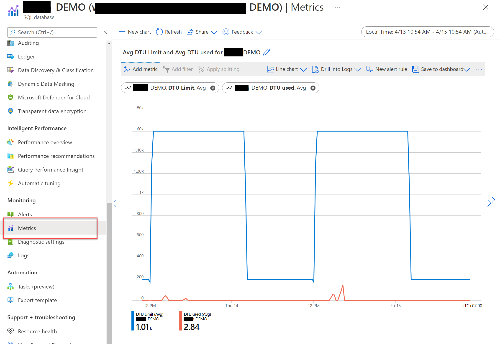

# ตั้งเวลา Scale Up, Down ให้ Azure SQL Database แบบ DTU

เนื่องจาก Database แบบ DTU ยังไม่มี Option ให้ทำ Auto Scale เพื่อให้ขนาดใหญ่ขึ้นได้ ดังนั้น
ถ้าเราจะทำเราสามารถใช้ GitHub Actions ช่วยได้

ใน GitHub Action จะใช้ [crontab](https://crontab.guru) ในการตั้งค่าเวลา

**ตั้งค่าเฉพาะวันจันทร์ - ศุกร์**

- Start Scale Up: `0 6 * * 1-5`  (“At 06:00 UTC on every day-of-week from Monday through Friday.”) ลองดูเพิ่มที่ <a href="https://crontab.guru/#0_6_*_*_1-5">crontab.guru</a>
- Start Scale Down: `0 18 * * 1-5`  (“At 18:00 UTC on every day-of-week from Monday through Friday.”) ลองดูเพิ่มที่ <a href="https://crontab.guru/#0_18_*_*_1-5">crontab.guru</a>


**ตั้งค่าให้ทำงานทุกวัน**

- `0 6 * * *`  (Every Day “At 06:00.” UTC) 
- `0 18 * * *` (Every Day “At 18:00.” UTC) 

## ตัวอย่าง

**Project Structure**

```
.
├── composite
│   └── scale-sql-database
│       └── action.yml
└── scale-sql-db.yml
```

ในตัวอย่างนี้ เราสามารถ Scale แบบ manual ได้ด้วย

```yaml
# scale-sql-db.yml

name: "Scale sql database by schedule"

on:
  # Triggers the workflow on push or pull request events but only for the main branch
  schedule:
    # Test Scale up on Everyday
    - cron: '0 6 * * *'
    # Test Scale Down on Everyday
    - cron: '0 18 * * *'

  workflow_dispatch:
    inputs:
      service_objective:
        description: service objective

env:
  service_objective_scale_up: S7
  service_objective_scale_down: S4
  db_name: Database_Name
  db_server: server-name
  resource_group: resource-group-name

jobs:
  manual:
    name: scale at service_objective manually to ${{  github.event.inputs.service_objective }}
    if: github.event_name == 'workflow_dispatch'
    runs-on: ubuntu-latest
    steps:
      - uses: actions/checkout@v3
      - uses: ./.github/workflows/composite/scale-sql-database
        with: 
          azure_credentials: ${{ secrets.azure_credentials }}
          db_name: ${{ env.db_name }}
          db_server: ${{ env.db_server }}
          resource_group: ${{ env.resource_group }}
          service_objective: ${{ github.event.inputs.service_objective }}

  scale-up:
    name: Scale Up
    if: github.event.schedule == '0 5 * * *'
    runs-on: ubuntu-latest
    steps:
      - run: echo "Run at $(date)"
      - uses: actions/checkout@v3
      - uses: ./.github/workflows/composite/scale-sql-database
        with: 
          azure_credentials: ${{ secrets.azure_credentials }}
          db_name: ${{ env.db_name }}
          db_server: ${{ env.db_server }}
          resource_group: ${{ env.resource_group }}
          service_objective: ${{ env.service_objective_scale_up }}

  scale-down:
    name: Scale Down
    if: github.event.schedule == '0 19 * * *'
    runs-on: ubuntu-latest
    steps:
      - run: echo "Run at $(date)"
      - uses: actions/checkout@v3
      - uses: ./.github/workflows/composite/scale-sql-database
        with: 
          azure_credentials: ${{ secrets.azure_credentials }}
          db_name: ${{ env.db_name }}
          db_server: ${{ env.db_server }}
          resource_group: ${{ env.resource_group }}
          service_objective: ${{ env.service_objective_scale_down }}
```

### ตัวอย่าง Composite ที่เรียกใช้

```yaml
# composite/scale-sql-database/action.yml

name: "Scale SQL Database"
description: "Scale SQL Database"

inputs:
  azure_credentials:
    description: "Azure AD credentials"
    required: true
  db_name:
    description: "DB name"
    required: true
  db_server:
    description: "DB Server name"
    required: true
  resource_group:
    description: "Resource Group"
    required: true
  service_objective:
    description: "Service Objective"
    required: true

runs:
  using: "composite"
  steps:
    - uses: azure/login@v1
      with:
        creds: ${{ inputs.azure_credentials }}

    - name: Scaling DB to ${{ inputs.service_objective }}
      run: |
        az sql db update --resource-group '${{ inputs.resource_group }}' --server '${{ inputs.db_server }}' --name '${{ inputs.db_name }}' --service-objective '${{ inputs.service_objective }}'
      shell: bash
```

## การดู Log การ Scale Database

เราสามารถเลือกดูที่เมนู Metric แล้วเลือก `DTU_Limit` ได้เลย สังเกตุจากเส้นสีน้ำเงิน

