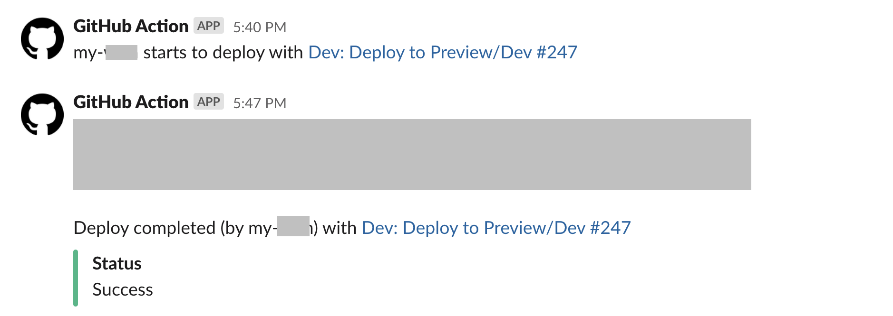
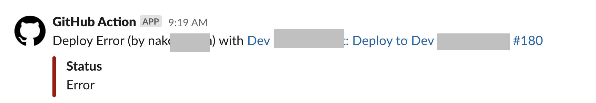

# แจ้งเตือนไปยัง Slack เมื่อ Workflow ทำงานเสร็จ

ถ้าเรามีหลาย Workflow แล้วต้องการที่จะแจ้งเตือนไปยัง Slack เมื่อ Workflow ทำงานเสร็จ การใช้ Event ที่ชื่อ `workflow_run` ทำให้เราสามารถ Reuse code ได้โดยที่ไม่ต้องเขียน job notify ไปยัง Slack ซ้ำๆ ทุกๆ Workflow

## รูปแบบการทำงาน

โดยจะแจ้งเตือนทั้งหมด 3 เงื่อนไข
1. เมื่อ Workflow เริ่ม (`on-requested`)
2. เมื่อ Workflow ทำงานเสร็จ ปกติ (`on-success`)
    
3. เมื่อ Workflow ทำงานเสร็จ แต่ Error (`on-failure`)
    


## ในนี้เรื่องนี้เราได้เรียนรู้อะไรบ้าง
- ในตัวอย่างนี้จะใช้ Event ที่ชื่อ  `workflow_run` ในการ reuse workflows โดยที่เราไม่ต้องแก้ไข Workflow เดิมเพื่อที่จะส่ง Notify ไปยัง Slack เมื่อ workflow ที่ถูกตั้งค่าไว้ทำงาน เช่น
  ```yaml
  workflow_run:
    workflows: 
      - "Deploy to A"
      - "Deploy to B"
  ```
  เมื่อ workflows ที่ติดตั้งไว้ แล้วทำงาน ตัว workflow ที่เป็น `workflow_run` ถึงจะเริ่มทำงาน
- ในการเริ่มทำงานของ `workflow_run` สามารถ Trigger ได้ 2 type คือ `[completed, requested]`
  - `requested` คือ เมื่อ Workflow ที่ติดตั้งไว้นี้เริ่มต้นทำงาน
  - `completed` คือ เมื่อ Workflow ที่ติดตั้งไว้นี้ทำงานเสร็จ 
- โดยในตัวอย่างการส่ง Notify ไปยัง Slack มี 3 jobs คือ
  - `on-requested` จะทำงานเมื่อ Workflow ที่ติดตั้งไว้นี้เริ่มต้นทำงาน
  - `on-success` จะทำงานเมื่อ Workflow ที่ติดตั้งไว้นี้ทำงานเสร็จ และ สำเร็จ
  - `on-failure` จะทำงานเมื่อ Workflow ที่ติดตั้งไว้นี้ทำงานเสร็จ แต่ Error
- ใน job ที่ชื่อ `on-requested` จะเช็ค `workflow_run` status เป็น `queued` แทนที่จะเป็น `request` เพราะว่า ตอนที่ `workflow_run` เริ่มทำงาน status คือ `queued`
- ส่วนใน Job ที่ชื่อ `on-success` จะเช็ค 2 เงื่อนไขคือ
  - `workflow_run.status` ไม่ใช่ `skipped` ใช้กรณี ป้องกันการทำงานซ้ำซ้อนกัน เพราะถ้า workflow ถูก skip แสดงว่า มันไม่ควรจะ trigger `on-success`
  -  `workflow_run.conclusion` คือ `completed` หมายถึง Workflow ที่ติดตั้งไว้นี้ทำงานเสร็จ และ สำเร็จ
- สุดท้าย Job ที่ชื่อ `on-failure` จะเช็ค 2 เงื่อนไขคล้ายๆ กับ `on-success` แต่จะเช็ค `workflow_run.conclusion` คือ `failure` แทน

## วิธีตั้งค่า

1. เราต้องไปสร้าง App ใน Slack แล้วสร้าง SLACK_WEBHOOK_URL มา อ่านเพิ่มที่ [Slack Doc](https://api.slack.com/messaging/webhooks)

2. การวาง Event ประเภท `workflow_run` จะต้องอยู่ใน default branch ของ GitHub Repo เท่านั้น ถึงจะได้ทำงาน

```yaml
name: "Util: Notify Slack"

on:
  workflow_run:
    workflows: 
      - "The Workflow Name That you want this actions trigger"
      
    types: [completed, requested]

jobs:
  on-requested:
    runs-on: ubuntu-latest
    if: ${{ github.event.workflow_run.status == 'queued' }}
    steps:
      - name: Send custom JSON data to Slack workflow
        uses: slackapi/slack-github-action@v1.18.0
        with:
          # For posting a rich message using Block Kit
          payload: |
            {
              "attachments": [
                {
                  "mrkdwn_in": ["pretext"],
                  "color": "#dddddd",
                  "pretext": "${{ github.actor}} starts to deploy with <${{ github.event.workflow_run.html_url }}|${{ github.event.workflow_run.name }} #${{ github.event.workflow_run.run_number }}>"
                }
              ]
            }
        env:
          SLACK_WEBHOOK_URL: ${{ secrets.SLACK_WEBHOOK_URL_TO_DEPLOYMENT_REQUEST }}
          SLACK_WEBHOOK_TYPE: INCOMING_WEBHOOK

  on-success:
    runs-on: ubuntu-latest
    if: ${{ github.event.workflow_run.status != 'skipped' && github.event.workflow_run.conclusion == 'success' }}
    steps:
      - name: Send custom JSON data to Slack workflow
        uses: slackapi/slack-github-action@v1.18.0
        with:
          # For posting a rich message using Block Kit
          payload: |
            {
              "attachments": [
                {
                  "mrkdwn_in": ["pretext"],
                  "color": "good",
                  "pretext": "Deploy completed (by ${{ github.actor}}) with <${{ github.event.workflow_run.html_url }}|${{ github.event.workflow_run.name }} #${{ github.event.workflow_run.run_number }}>",
                  "fields": [
                      {
                          "title": "Status",
                          "value": "Success",
                          "short": true
                      }
                  ]
                }
              ]
            }
        env:
          SLACK_WEBHOOK_URL: ${{ secrets.SLACK_WEBHOOK_URL_TO_DEPLOYMENT_REQUEST }}
          SLACK_WEBHOOK_TYPE: INCOMING_WEBHOOK
          
  on-failure:
    runs-on: ubuntu-latest
    if: ${{ github.event.workflow_run.status != 'skipped' && github.event.workflow_run.conclusion == 'failure' }}
    steps:
      - name: Send custom JSON data to Slack workflow
        uses: slackapi/slack-github-action@v1.18.0
        with:
          # For posting a rich message using Block Kit
          payload: |
            {
              "attachments": [
                {
                  "mrkdwn_in": ["pretext","footer"],
                  "color": "danger",
                  "pretext": "Deploy Error (by ${{ github.actor}}) with <${{ github.event.workflow_run.html_url }}|${{ github.event.workflow_run.name }} #${{ github.event.workflow_run.run_number }}>",
                  "fields": [
                      {
                          "title": "Status",
                          "value": "Error",
                          "short": true
                      }
                  ]
                }
              ]
            }
        env:
          SLACK_WEBHOOK_URL: ${{ secrets.SLACK_WEBHOOK_URL_TO_DEPLOYMENT_REQUEST }}
          SLACK_WEBHOOK_TYPE: INCOMING_WEBHOOK
```