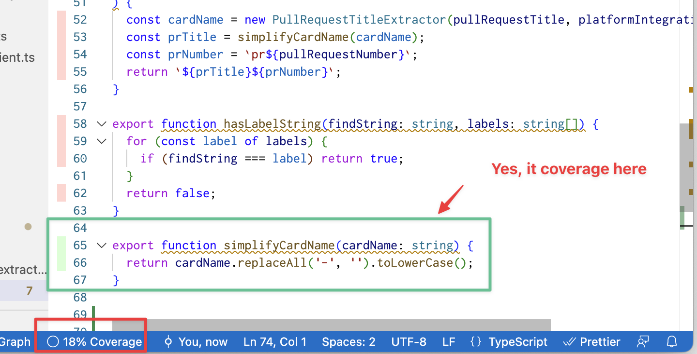

# Coverage Test Tool

[Coverage Gutters](https://marketplace.visualstudio.com/items?itemName=ryanluker.vscode-coverage-gutters) in VS Code

## Example Usage

https://medium.com/flutter-community/shortening-flutter-test-feedback-cycle-in-vs-code-890ab15c0b2d